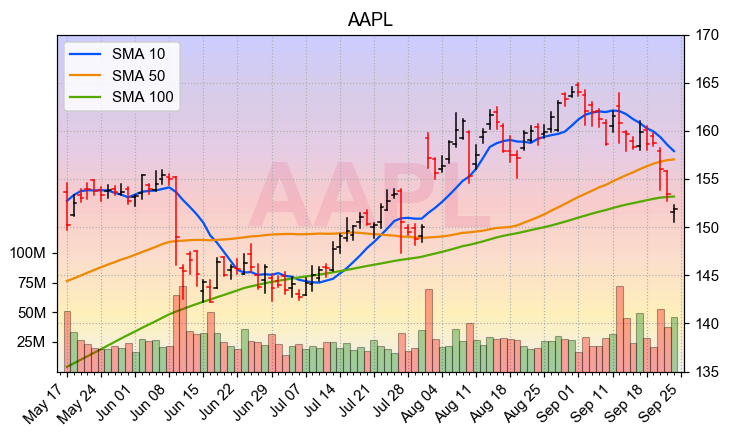

Regression Analysis with Tensorflow System
===

This is a collection of example analyses using deep-learning inference, filtering, and preditions. Most examples are just simple illustrative scripts that either I put together from scratch to help me learn or something that I modified from a tutorial somewhere in the internet.

## Requirements

Install the required packages
```shell
sudo -H python -m pip install -r requirements.txt
```

## Create a Virtual Environment (Recommended)

Create a new virtual environment by choosing a Python interpreter and making a `./venv` directory to hold it:
```shell
virtualenv --system-site-packages -p python3 ./venv
```
Activate the virtual environment using a shell-specific command:
```shell
source ./venv/bin/activate
```
And to exit virtualenv later:
```shell
deactivate
```

## Example Scripts

A few trivial example scripts as I was learning how to setup NN through tensorflow.

- `eg1.py` - Simple linear regression using gradient descent
- `eg2.py` - Simple inference can be affected by pre-conditioning
- `eg3.py` - Data pre-processing from spread sheet to usable format

## Retrieving Data

```python
import data
quotes = data.get_old_indices()
data.save_to_folder(quotes)
```

## Get the Spyder IDE (Recommended)

Under macOS with [Homebrew]:
```shell
brew install spyder3
```
Under Ubuntu:
```shell
sudo apt-get install spyder3
```

## US Stock Market Time Series

The stock market is arguably one of the most interesting time-series data, right? So, that's what we will start with.

The data can be retrieved live using the [pandas-datareader]. There are several back-end engines to choose from depending on the package is updated. While the some API may yet to be stable, a local copy can be stored for repetitive experimentation.

## Stock Chart

A convenient function to generate stock chart is included.



## Toubleshooting

Here are some problems and solutions I have encountered.

### Unable to Install Tensorflow

Visit [Tensorflow] installation page for custom Tensorflow installation instructions

### Python Packages

For some macOS scenarios, Python packages that are installed may not be detected correctly by the `pip` tool. In that case, the following script may help. Create a script named `kernel.json` under the project folder and copy and paste the following lines to and adopt the actual path of where your Python library is installed to the text file.
```json
{
 "argv": [
  "/usr/local/bin/python3",
  "-m",
  "ipykernel_launcher",
  "-f",
  "{connection_file}"
 ],
 "display_name": "Python 3",
 "language": "python",
 "env": {
     "PYTHONPATH": "/usr/local/Cellar/python/3.7.2/Frameworks/Python.framework/Versions/3.7/lib/python3.7/"
 }
}
```

### Configure `matplotlib`

To get the same plotting style like the example, create a file `~/.matplotlib/matplotlibrc` and add the following code:
```
# Add these to ~/.matplotlibrc/matplotlibrc

backend             : TkAgg
font.family         : serif
font.style          : normal
font.serif          : Arial, Helvetica
font.sans-serif     : System Font, Verdana, Arial
figure.figsize      : 8.89, 5
figure.dpi          : 144

```
Anohter option to change it without the configuration file is by entering the following code into the Python console.
```python
import matplotlib
matplotlib.rcParams['font.family'] = 'serif'
matplotlib.rcParams['font.serif'] = ['Arial', 'Helvetica']
matplotlib.rcParams['font.sans-serif'] = ['System Font', 'Verdana', 'Arial']
matplotlib.rcParams['figure.figsize'] = (8.89, 5)   # Change the size of plots
matplotlib.rcParams['figure.dpi'] = 144
```
If you encountered an error 'ImportError: Python is not installed as a framework.' due to `matplotlib`. You may need to change the `backend` value to `Agg`.

[pandas-datareader]:https://pandas-datareader.readthedocs.io/en/latest/
[TensorFlow]: https://www.tensorflow.org/install/pip
[Homebrew]: https://brew.sh