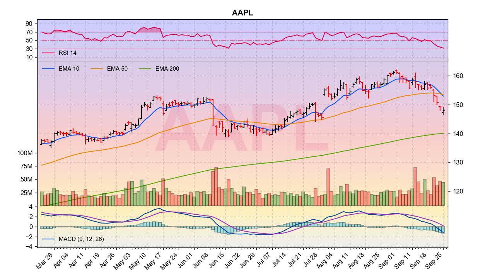

Various Analyses on Time Series
===

Example analyses using various deep-learning techniques, filtering, preditions. These are just example scripts that either I put together from scratch to help me learn or some that are modified from a tutorial somewhere in the cyberspace.

## Requirements

Install the required packages
```shell
sudo -H python -m pip install -r requirements.txt
```

## Create a Virtual Environment (Recommended)

Create a new virtual environment by choosing a Python interpreter and making a `./venv` directory to hold it:
```shell
virtualenv --system-site-packages -p python3 ./env
```
Activate the virtual environment using a shell-specific command:
```shell
source ./venv/bin/activate
```
And to exit virtualenv later:
```shell
deactivate
```

## Stock Market Time Series

The stock market is arguably one of the most interesting time-series data, right? So, that's what we will start with.

The data can be retrieved live using the Yahoo or Google API through [pandas-datareader]. While the Google API is yet to be stable, a cache copy can be stored locally for repetitive experimentation.

## Chart

A convenient function to generate chart is included.



## Example Scripts

A few trivial example scripts as I was learning how to setup NN through tensorflow.

- `eg1.py` - Simple linear regression using gradient descent
- `eg2.py` - Simple inference can be affected by pre-conditioning
- `eg3.py` - Data pre-processing from spread sheet to usable format

## Retrieving Data

```python
import data
quotes = data.get_old_indices()
data.save_to_folder(quotes)
```
### Install Tensorflow

Visit [Tensorflow] installation page for further installation

[pandas-datareader]:https://pandas-datareader.readthedocs.io/en/latest/

[TensorFlow]: https://www.tensorflow.org/install/pip
